# 🌟 ScoopSocials Platform Comprehensive Overview

## **What is ScoopSocials?**

ScoopSocials is a revolutionary **trust-based social verification platform** that creates authentic digital communities through peer-to-peer reviews and comprehensive identity verification. It's a unified ecosystem where users connect their social media profiles, build trust scores through community validation, and engage in verified interactions across professional, social, and marketplace contexts.

## **Platform Vision & Mission**

### **Mission Statement:**
*"Beyond Verification, Ensuring Authenticity"* - To revolutionize online identity verification and create a more authentic digital world where trust is the foundation of all interactions.

### **Core Problem Solved:**
- **Identity Fraud Crisis**: Combat the 50% bot traffic overwhelming digital interactions
- **Trust Fragmentation**: Unify scattered social media identities into one verified profile
- **Verification Challenges**: Provide real-time, community-validated authenticity
- **Business Engagement Gap**: Enable real-time event tracking and community insights

## **How ScoopSocials Works**

### **1. Identity Unification & Verification**
- Users connect multiple social media accounts (Twitter/X, LinkedIn, Instagram, Facebook, TikTok)
- AI-powered verification analyzes account authenticity and activity patterns
- 11-factor trust algorithm evaluates social presence, network quality, and engagement

### **2. Community-Driven Trust Building**
- **Friend-based review system**: Only verified friends can review each other
- **5 Core Review Categories**: Professional, Marketplace, Dating, Social, General
- **Dynamic trust scoring** based on community validation and peer feedback
- **Real-time trust impact** prediction and transparent scoring

### **3. Cross-Platform Integration**
- **Dating apps**: Enhanced profiles for Tinder, Hinge, Bumble
- **Professional networks**: Contractor verification, freelance credibility
- **E-commerce**: Marketplace seller/buyer authentication
- **Event venues**: Real-time patron engagement and promotion tools

## **Why ScoopSocials is Unique**

### **🎯 Unique Value Propositions:**

1. **True Identity Verification**: Not just email/phone - comprehensive social media cross-validation
2. **Friend-Only Reviews**: Eliminates fake reviews by restricting to verified friend networks
3. **Dynamic Trust Algorithm**: Real-time scoring that evolves with user behavior and community validation
4. **Cross-Platform Integration**: One verified identity works across multiple external platforms
5. **Business Intelligence Layer**: Venues and organizations get real-time engagement analytics
6. **AI-Powered Safety**: Sentiment analysis, fraud detection, and pattern recognition for community protection

### **🚀 Competitive Advantages:**

- **Network Effect**: As more platforms integrate, user value exponentially increases
- **Trust Monetization**: High-trust users unlock premium features and partner benefits
- **Real-Time Validation**: Instant community feedback vs. static verification systems
- **Multi-Context Reviews**: Same identity works for dating, business, marketplace interactions
- **Anti-Bot Technology**: Advanced AI detection licensable to third parties

---

## **User Flows & Journey Maps**

### **📱 Primary User Flows**

#### **Flow 1: New User Onboarding**
```
Landing Page → Sign Up → Connect Social Accounts → Verify Identity → 
Find Friends → Create First Review → Explore Platform → Set Preferences
```

#### **Flow 2: Writing a Review**
```
Home/Profile → Create Post → Select Friend → Choose Category → 
Write Review → Add Tags/Photo → Privacy Check → Submit → Share
```

#### **Flow 3: Trust Score Building**
```
Initial Score → Connect Accounts (+20%) → Get Reviews (+30%) → 
Give Reviews (+15%) → Verify Photos (+10%) → Engage Community (+25%)
```

#### **Flow 4: Business/Venue Integration**
```
Venue Account → Event Creation → Promotion Broadcast → 
Real-time Attendance → Engagement Analytics → Follow-up Marketing
```

---

## **Complete Platform Flow Diagram**


## **Detailed User Flow Charts**

### **1. New User Onboarding Flow**

```mermaid
flowchart TD
    A[Land on ScoopSocials] --> B{User Type?}
    
    B -->|Individual| C[Sign Up Individual]
    B -->|Business| D[Sign Up Business]
    B -->|From Partner| E[Partner Referral]
    
    C --> F[Choose Auth Method]
    F --> F1[Email/Password]
    F --> F2[Google OAuth]
    F --> F3[Apple ID]
    F --> F4[Facebook Login]
    
    F1 --> G[Verify Email]
    F2 --> G
    F3 --> G
    F4 --> G
    
    G --> H[Profile Setup Wizard]
    H --> H1[Basic Info Entry]
    H1 --> H2[Profile Photo Upload]
    H2 --> H3[Privacy Preferences]
    
    H3 --> I[Social Account Linking]
    I --> I1[Connect Twitter/X]
    I --> I2[Connect LinkedIn]
    I --> I3[Connect Instagram]
    I --> I4[Connect Facebook]
    I --> I5[Connect TikTok]
    
    I1 --> J[AI Verification Process]
    I2 --> J
    I3 --> J
    I4 --> J
    I5 --> J
    
    J --> K{Verification Result}
    K -->|Success| L[Account Verified ✅]
    K -->|Needs Review| M[Manual Review Required]
    K -->|Failed| N[Verification Failed ❌]
    
    L --> O[Friend Discovery]
    M --> O1[Wait for Review] --> O
    N --> N1[Retry Verification] --> I
    
    O --> P[Import Contacts]
    P --> Q[Find Existing Friends]
    Q --> R[Send Friend Requests]
    R --> S[Tutorial: Write First Review]
    
    S --> T[Choose Friend to Review]
    T --> U[Select Review Category]
    U --> V[Write Review Content]
    V --> W[Add Tags & Photo]
    W --> X[Submit First Review]
    
    X --> Y[Trust Score Initialization]
    Y --> Z[Welcome to ScoopSocials! 🎉]
    Z --> AA[Explore Platform Features]
    
    D --> DB[Business Verification]
    DB --> DC[Upload Business Documents]
    DC --> DD[Business Type Selection]
    DD --> DE[Payment Setup]
    DE --> DF[Business Dashboard Access]
    
    E --> EE[Auto-populate from Partner]
    EE --> G
    
    style A fill:#e3f2fd
    style L fill:#e8f5e8
    style N fill:#ffebee
    style Z fill:#f3e5f5
```



### **2. Review Creation Flow**

```mermaid
flowchart TD
    A[User Wants to Write Review] --> B[Access Create Post]
    
    B --> C[Friend Selection Interface]
    C --> D{Search or Browse?}
    
    D -->|Search| E[Enter Friend Name]
    D -->|Browse| F[View Recent Friends List]
    
    E --> G[Filter Search Results]
    F --> H[Select from Recent 3 Friends]
    G --> I[Select Friend from Results]
    H --> I
    
    I --> J{Friend Relationship?}
    J -->|Verified Friend| K[Proceed to Category]
    J -->|Not Friend| L[Send Friend Request First]
    
    L --> M[Wait for Friend Acceptance]
    M --> K
    
    K --> N[Category Selection Screen]
    N --> O{Choose Category}
    
    O -->|💼| P1[Professional Review]
    O -->|🛒| P2[Marketplace Review]
    O -->|💕| P3[Dating Review]
    O -->|🤝| P4[Social Review]
    O -->|🔗| P5[General Review]
    
    P1 --> Q[Review Writing Interface]
    P2 --> Q
    P3 --> Q
    P4 --> Q
    P5 --> Q
    
    Q --> R[Text Input Area (300 chars)]
    R --> S{Add Media?}
    
    S -->|Yes| T[Photo Upload]
    S -->|No| U[Tag Selection]
    
    T --> T1[Select Photo from Gallery]
    T --> T2[Take New Photo]
    T1 --> T3[Photo Verification]
    T2 --> T3
    T3 --> U
    
    U --> V[Quick Tag Selection]
    V --> W[Custom Tag Entry]
    W --> X[Review Preview]
    
    X --> Y{Review Quality Check}
    Y -->|Good| Z[Privacy Settings Review]
    Y -->|Needs Improvement| AA[Suggestions for Enhancement]
    
    AA --> AB[Apply AI Suggestions]
    AB --> X
    
    Z --> BB[Final Confirmation]
    BB --> CC[Submit Review]
    
    CC --> DD[AI Content Analysis]
    DD --> EE{Content Appropriate?}
    
    EE -->|Yes| FF[Publish Review]
    EE -->|Flagged| GG[Human Moderation Queue]
    
    FF --> HH[Update Trust Scores]
    HH --> II[Notify Reviewed Person]
    II --> JJ[Share Options]
    
    GG --> KK[Moderator Review]
    KK --> LL{Moderator Decision}
    LL -->|Approve| FF
    LL -->|Reject| MM[Rejection Notice]
    
    JJ --> NN[Cross-Platform Sharing]
    NN --> OO[Review Complete! 🎉]
    
    style A fill:#e3f2fd
    style K fill:#e8f5e8
    style L fill:#fff3e0
    style FF fill:#e8f5e8
    style MM fill:#ffebee
    style OO fill:#f3e5f5
```

### **3. Trust Score Building Flow**


### **4. Business User Flow**


### **5. Cross-Platform Integration Flow**


## **Platform Architecture Overview**

### **Core System Components:**

#### **🔐 User Identity Layer**
- **📱 Social Media Linking**: Multi-platform account connection and verification
- **🔍 AI Identity Verification**: Automated authenticity analysis and pattern recognition
- **📋 Profile Unification**: Single verified identity across all contexts
- **🛡️ Anti-Bot Detection**: Advanced AI fraud prevention and spam filtering

#### **🤝 Social Verification Layer**
- **👥 Friend Network Mapping**: Relationship verification and network quality analysis
- **✍️ Peer Review System**: Friend-only review mechanism with category-based organization
- **🏷️ Category-Based Reviews**: Professional, Marketplace, Dating, Social, General contexts
- **📸 Photo Verification**: Image authenticity and geo-tagging validation

#### **📊 Trust Algorithm Engine**
- **📈 11-Factor Scoring**: Comprehensive trust evaluation across multiple dimensions
- **⚡ Real-time Updates**: Dynamic scoring that responds to user behavior
- **🎯 Predictive Analytics**: Trust trajectory forecasting and risk assessment
- **🔄 Community Validation**: Peer-verified trust building and reputation management

#### **🔗 Integration Layer**
- **💕 Dating Platforms**: Enhanced profile verification for romantic connections
- **💼 Professional Networks**: Freelance credibility and business partnership validation
- **🛒 E-commerce Sites**: Marketplace seller/buyer authentication and fraud prevention
- **🏢 Business Tools**: Event management, engagement analytics, and promotional features

---

## **User Journey Flow Diagram**

### **Entry Points → Core Activities → Trust Building → Premium Benefits**

```
🚀 User Entry Points
├── 📱 Mobile App
├── 💻 Web Platform
└── 🔗 Partner Integration

↓

📋 Onboarding Flow
├── 🔗 Social Account Linking
├── 👥 Friend Discovery
├── ✍️ First Review
└── 📊 Trust Score Activation

↓

🎯 Core Activities
├── 📝 Write Reviews
├── 🎉 Attend Events
├── 🛒 Marketplace Activity
├── 💕 Dating Integration
└── 💼 Professional Use

↓

📈 Trust Building
├── Community Validation
├── Cross-Platform Verification
├── Engagement Quality
└── Network Growth

↓

🌟 Premium Benefits
├── 💎 Partner Discounts
├── 🎁 Exclusive Features
├── 🔑 Priority Access
└── 💰 Insurance Benefits
```

---

## **User Types & Experiences**

### **🎮 Individual Users**
- **Students**: Campus event discovery, study group formation, roommate matching
- **Professionals**: Freelance credibility, networking, business partnerships  
- **Dating Users**: Enhanced profile trust, safer connections, verified interactions
- **Consumers**: Marketplace safety, service provider verification, local recommendations

### **🏢 Business Users**
- **Venues/Bars**: Event promotion, real-time engagement tracking, customer insights
- **Educational Institutions**: Student verification, campus safety, event management
- **E-commerce Platforms**: Seller verification, fraud reduction, trust-based discounts
- **Insurance Companies**: Risk assessment, policy pricing, claim validation

---

## **Business Model & Revenue Streams**

### **💰 Multi-Tiered Revenue Strategy**

#### **1. Freemium Model**
- **Basic verification and reviews**: Free
- **Premium features**: $9.99/month
  - Advanced analytics dashboard
  - Priority customer support
  - Enhanced profile customization
  - Cross-platform integration tools
- **Advanced analytics**: $19.99/month
  - Detailed trust score insights
  - Network analysis tools
  - Engagement optimization recommendations

#### **2. Professional & Venue Accounts**
- **Business verification**: $49/month
  - Verified business badge
  - Basic analytics
  - Customer review management
- **Event management tools**: $99/month
  - Real-time event tracking
  - Promotion broadcasting
  - Attendee engagement metrics
- **Real-time analytics dashboard**: $199/month
  - Advanced business intelligence
  - Predictive engagement modeling
  - Custom reporting tools

#### **3. Integration Licensing**
- **Dating platform API**: $0.10 per verification
- **E-commerce fraud prevention**: $0.05 per transaction
- **Insurance risk assessment**: Revenue sharing model (10-15%)
- **Professional network integration**: $0.25 per profile verification

#### **4. Trust Marketplace**
- **Partner discount programs**: Commission-based (5-20%)
- **Premium placement**: $500-$2000/month
- **Sponsored trust boosts**: $1-$5 per boost
- **Referral rewards**: $5-$25 per successful conversion

---

## **Technology Stack & Innovation**

### **🤖 AI-Powered Features**

#### **Trust Algorithm Components:**
- **Social Media Verification (20%)**: Account age, followers, engagement patterns
- **Community Network (20%)**: Friend quality, review reciprocity, network density
- **Platform Activity (15%)**: Review quality, response time, engagement level
- **Content Quality (15%)**: Review helpfulness, photo verification, detail level
- **External Validation (10%)**: Cross-platform consistency, third-party confirmations
- **Behavioral Patterns (10%)**: Login frequency, feature usage, community participation
- **Photo Verification (5%)**: Face recognition, image authenticity, geo-tagging
- **Response Rate (3%)**: Communication responsiveness, follow-through
- **Account Age (2%)**: Platform tenure, consistency over time

#### **Advanced AI Capabilities:**
- **Sentiment Analysis**: Real-time review emotion and intent detection
- **Fraud Detection**: Pattern recognition for fake accounts and bot behavior
- **Trend Identification**: Community insights and engagement optimization
- **Predictive Scoring**: Trust trajectory forecasting and risk assessment

### **🔧 Technical Infrastructure**
- **Frontend**: Next.js 14, TypeScript, Tailwind CSS
- **Backend**: Node.js, Express, PostgreSQL
- **Authentication**: Auth0 with social media OAuth integration
- **AI/ML**: TensorFlow, natural language processing, computer vision
- **Cloud**: AWS/Vercel with CDN for global performance
- **Analytics**: Custom dashboard with real-time data processing

---

## **Market Positioning & Competitive Landscape**

### **🎯 Target Markets**

1. **Primary Market**: 18-35 year olds active on multiple social platforms
2. **Secondary Market**: Professionals seeking credible online presence
3. **Business Market**: Venues, educational institutions, e-commerce platforms
4. **Integration Market**: Dating apps, professional networks, insurance companies

### **🏆 Competitive Advantages vs. Existing Solutions**

| **Feature** | **ScoopSocials** | **LinkedIn** | **Facebook** | **Dating Apps** |
|-------------|------------------|--------------|--------------|-----------------|
| Cross-platform verification | ✅ Complete | ❌ Professional only | ❌ Single platform | ❌ Basic photos |
| Friend-only reviews | ✅ Yes | ❌ Public endorsements | ❌ No review system | ❌ No reviews |
| Real-time trust scoring | ✅ Dynamic | ❌ Static skills | ❌ No scoring | ❌ No trust metrics |
| Anti-bot technology | ✅ Advanced AI | ✅ Basic | ❌ Limited | ❌ Minimal |
| Business integration | ✅ Multi-industry | ✅ Professional | ✅ Business pages | ❌ Dating only |
| Category-based reviews | ✅ 5 categories | ❌ Skills only | ❌ No categories | ❌ No reviews |
| Trust monetization | ✅ Partner benefits | ❌ No trust rewards | ❌ No trust system | ❌ No benefits |

---

## **Platform Features & Capabilities**

### **🌟 Core Features**

#### **For Individual Users:**
- **Unified Profile Management**: Single dashboard for all social connections
- **Friend-Based Reviews**: Write and receive reviews from verified friends
- **Trust Score Tracking**: Real-time trust score with improvement suggestions
- **Category Selection**: Choose from Professional, Marketplace, Dating, Social, General
- **Photo Verification**: Upload and verify photos for enhanced credibility
- **Privacy Controls**: Granular control over review visibility and sharing
- **Cross-Platform Integration**: Use trust score across partner platforms

#### **For Businesses:**
- **Event Management**: Create, promote, and track events in real-time
- **Customer Analytics**: Detailed insights into patron engagement and behavior
- **Verification Tools**: Verify customer identities and build trust networks
- **Promotional Broadcasting**: Reach verified, engaged audiences
- **Review Management**: Monitor and respond to customer feedback
- **Integration APIs**: Connect with existing business systems

### **🎨 User Interface Highlights**
- **Minimal Design**: Clean, streamlined interface focused on essential actions
- **Mobile-First**: Optimized for mobile usage with responsive design
- **Quick Actions**: Streamlined review creation process (300 characters max)
- **Visual Feedback**: Progress indicators, trust score visualizations, engagement metrics
- **Accessibility**: Full screen reader support and keyboard navigation

---

## **Platform Impact & Future Vision**

### **🌍 Societal Impact Goals**

1. **Digital Trust Restoration**: Reduce online fraud and increase authentic interactions
2. **Community Safety**: Enable safer dating, marketplace, and professional connections
3. **Economic Efficiency**: Reduce transaction costs through verified trust networks
4. **Social Equity**: Provide equal access to trust-building regardless of background

### **🚀 Future Roadmap**

#### **Phase 1: Foundation (Current)**
- ✅ Core platform with 5 review categories
- ✅ Basic social media integration
- ✅ Friend-based review system
- ✅ Trust score algorithm v1.0
- ✅ Mobile-optimized interface
- ✅ Photo upload capabilities

#### **Phase 2: Integration (6-12 months)**
- 🔄 Dating platform partnerships (Tinder, Hinge, Bumble)
- 🔄 E-commerce marketplace integration
- 🔄 Insurance partner pilot programs
- 🔄 Advanced AI fraud detection
- 🔄 Video review capabilities
- 🔄 Enhanced business analytics

#### **Phase 3: Expansion (12-24 months)**
- 📅 International market expansion
- 📅 Blockchain trust verification
- 📅 IoT integration for real-world verification
- 📅 Advanced gamification features
- 📅 AI-powered review assistance
- 📅 Trust marketplace launch

#### **Phase 4: Ecosystem (24+ months)**
- 🔮 Full trust economy marketplace
- 🔮 Decentralized identity protocol
- 🔮 Global verification standard
- 🔮 Trust-based financial services
- 🔮 Enterprise-grade business solutions
- 🔮 Government partnership programs

---

## **Success Metrics & KPIs**

### **📊 Platform Health Indicators**

#### **1. User Engagement**
- **Monthly Active Users (MAU)**: Target 100K by end of year 1
- **Reviews per user per month**: Target 2-3 reviews average
- **Cross-platform connection rate**: Target 80% of users connecting 3+ accounts
- **Trust score improvement rate**: Average +5 points per month for active users

#### **2. Trust Quality**
- **Review authenticity score**: Target 95% authentic reviews
- **Friend network density**: Average 15-25 verified friends per user
- **Cross-validation success rate**: 90% successful identity verification
- **Fraud detection accuracy**: 98% accurate bot/fake account detection

#### **3. Business Impact**
- **Partner integration growth**: 5-10 new integrations per quarter
- **Revenue per user (ARPU)**: Target $15-25 per month for premium users
- **Trust marketplace transaction volume**: $1M+ in first year
- **Customer acquisition cost (CAC)**: Target $25-50 per user

#### **4. Network Effects**
- **Viral coefficient**: Target 1.2-1.5 (each user brings 1.2-1.5 new users)
- **Platform switching reduction**: 80% user retention after 6 months
- **Trust score portability usage**: 70% of users utilize cross-platform benefits
- **Cross-platform benefit utilization**: 60% of users access partner discounts/features

---

## **Security & Privacy Framework**

### **🔒 Data Protection**
- **End-to-end encryption** for all sensitive communications
- **GDPR compliance** with user data rights and deletion capabilities
- **Minimal data collection** - only gather what's necessary for trust verification
- **User consent management** with granular permission controls

### **🛡️ Platform Safety**
- **Community moderation** with AI-assisted content filtering
- **Report and flag system** for inappropriate content or behavior
- **Anonymous reporting** to protect user privacy
- **Trust score penalties** for malicious behavior or policy violations

### **🔐 Technical Security**
- **Multi-factor authentication** for all account access
- **Regular security audits** and penetration testing
- **API rate limiting** and DDoS protection
- **Secure cloud infrastructure** with backup and disaster recovery

---

## **Partnership Strategy**

### **🤝 Strategic Partnerships**

#### **Dating Platforms**
- **Integration Benefits**: Enhanced profile verification, reduced catfishing, safer meetings
- **Revenue Model**: Per-verification licensing fees
- **User Value**: Increased match quality and safety

#### **E-commerce Marketplaces**
- **Integration Benefits**: Seller verification, fraud reduction, buyer confidence
- **Revenue Model**: Transaction-based fees and commission sharing
- **User Value**: Safer transactions and verified seller reputation

#### **Insurance Companies**
- **Integration Benefits**: Risk assessment, policy pricing, claim validation
- **Revenue Model**: Revenue sharing on improved risk models
- **User Value**: Premium discounts for high-trust users

#### **Educational Institutions**
- **Integration Benefits**: Student verification, campus safety, event management
- **Revenue Model**: Institutional licensing and per-student fees
- **User Value**: Enhanced campus community and verified connections

---

## **Marketing & Growth Strategy**

### **📈 User Acquisition**
- **Social Media Marketing**: Targeted campaigns on Instagram, TikTok, Twitter
- **Influencer Partnerships**: Micro-influencers in target demographics
- **Campus Ambassador Program**: University-based growth strategy
- **Referral Incentives**: Friend invitation rewards and trust score bonuses

### **🎯 Business Development**
- **Partner Integration Program**: API partnerships with existing platforms
- **Pilot Programs**: Free trials for early business adopters
- **Industry Conferences**: Presence at dating, e-commerce, and security events
- **Thought Leadership**: Content marketing on digital trust and verification

---

## **Financial Projections**

### **💰 Revenue Forecast (3-Year)**

#### **Year 1**
- **Users**: 50,000 registered, 15,000 active monthly
- **Revenue**: $750,000
  - Freemium subscriptions: $450,000
  - Business accounts: $200,000
  - Integration licensing: $100,000

#### **Year 2**
- **Users**: 250,000 registered, 100,000 active monthly
- **Revenue**: $4,200,000
  - Freemium subscriptions: $2,400,000
  - Business accounts: $1,000,000
  - Integration licensing: $500,000
  - Trust marketplace: $300,000

#### **Year 3**
- **Users**: 1,000,000 registered, 500,000 active monthly
- **Revenue**: $15,000,000
  - Freemium subscriptions: $7,200,000
  - Business accounts: $3,500,000
  - Integration licensing: $2,500,000
  - Trust marketplace: $1,800,000

---

## **Contact & Company Information**

### **📍 Company Details**
- **Company**: Scoop Technologies LLC
- **Address**: 1700 Pacific Ave Ste 1820, Dallas, TX
- **Email**: dev@scoopsocials.com
- **Phone**: (970) 306-7195
- **Website**: scoopsocials.com

### **👥 Team & Expertise**
- **Technical Leadership**: Full-stack development, AI/ML engineering
- **Business Development**: Partnership strategy, revenue optimization
- **Product Design**: User experience, interface design, mobile optimization
- **Security & Privacy**: Data protection, fraud prevention, compliance

---

## **Conclusion**

**ScoopSocials represents the future of digital trust** - a comprehensive ecosystem where authentic relationships, verified identities, and community validation create unprecedented safety and opportunity in our increasingly connected world.

By combining advanced AI technology with human-centered design and community-driven validation, ScoopSocials addresses the fundamental challenge of digital trust in the 21st century. Our platform doesn't just verify identity; it builds genuine community connections that enhance safety, enable opportunity, and create value across the entire digital ecosystem.

The future of online interaction is built on trust, and ScoopSocials is the foundation that makes that future possible. 🌟

---

*Last Updated: January 2025*
*Document Version: 1.0*
*© 2025 Scoop Technologies LLC. Beyond Verification, Ensuring Authenticity.* 